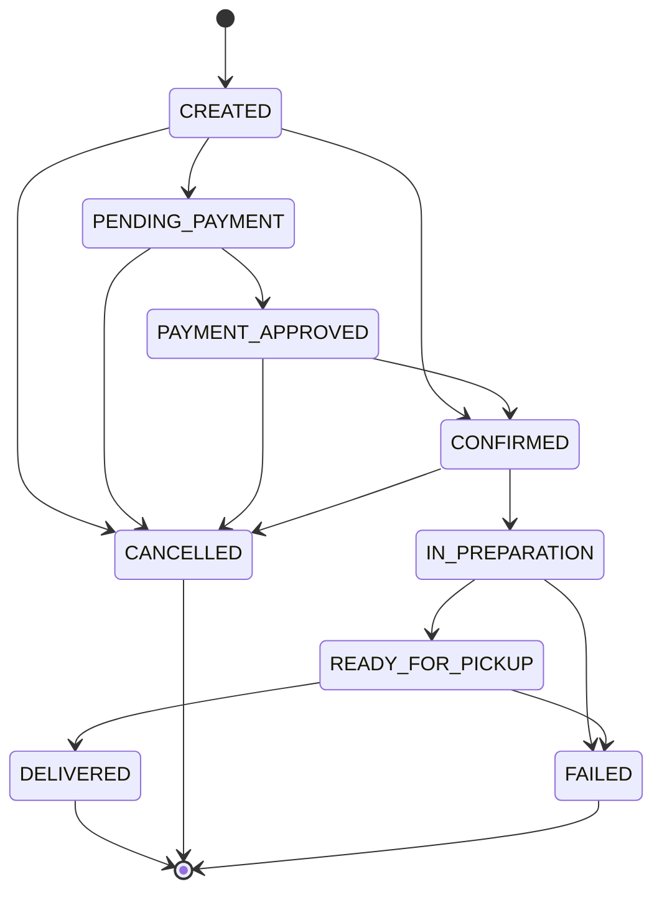

# ECIXPRESS Order & Communication

## Current shape

- REST for order lifecycle and chat history
- Socket.IO for real-time chat and order updates
- In-memory adapters as temporary infrastructure
- Ports are isolated inside the module so PostgreSQL and RabbitMQ can replace them later without changing controllers

## State machine

## WebSocket events

- `message:new`
- `message:read`
- `typing:start`
- `typing:stop`
- `conversation:joined`
- `conversation:left`
- `order:status-updated`

## RabbitMQ event names reserved for future integration

- `order.created`
- `order.confirmed`
- `order.ready`
- `order.cancelled`
- `order.delivered`
- `order.rated`
- `message.sent`

## Persistence target

- `orders`
- `order_items`
- `order_status_history`
- `order_ratings`
- `conversations`
- `conversation_participants`
- `messages`
- `message_read_status`